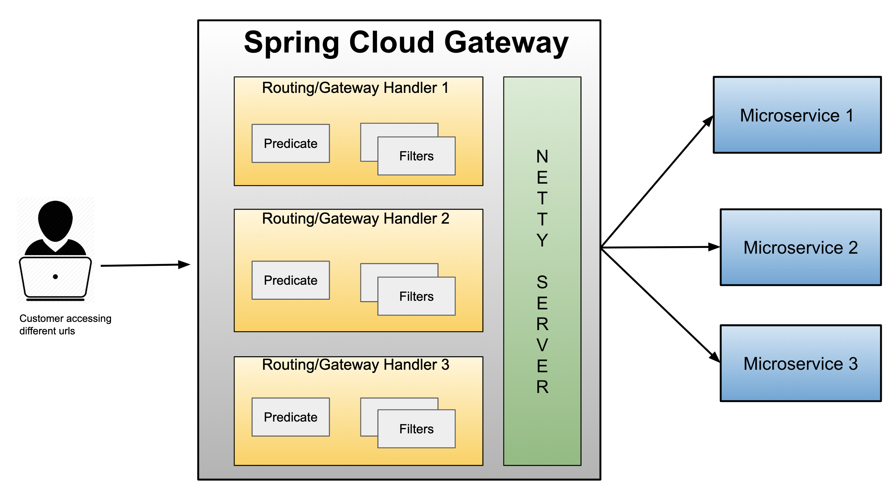
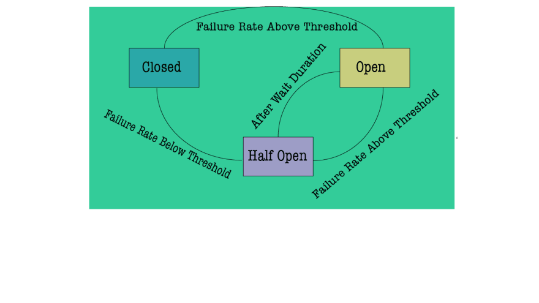

# spring-cloud-gateway

# Run the following projects to get the proper result

1. https://github.com/M-Thirumal/eureka-server
2. https://github.com/M-Thirumal/eureka-client-2
3. https://github.com/M-Thirumal/eureka-client-1

4. Redis

# To Create jar

 `mvn clean package -DskipTests=true`

# Run as jar from terminal
`java -jar target/spring-cloud-gateway-0.0.1-SNAPSHOT.jar`

# Gateway Architecture

# Rate Limiter (Service Denial)

Redis is used for rate limiter, which is used for protecting application from API throttling (Service Denial)

# Circuit Breaker

Circuit Breaker has three states `Closed State, Open State, Half Open State`. The image below shows how the flow from one state to another changes.

  1. The Circuit Breaker will be in the `Closed state` when everything is running as expected when failure starts coming it waits until the set `threshold limit` is reached then goes to `Open state`.
  
  2. While in `Open states` no calls will be going to failing remote service until certain wait time, then it goes to `Half-Open state`, in this stage reduced amount of calls goes to remote service to make sure the calls are successful, `IF` the calls are responding as `expected` it will go to `Closed state` or it goes back to `Open state` avoiding calls to failing remote service.

