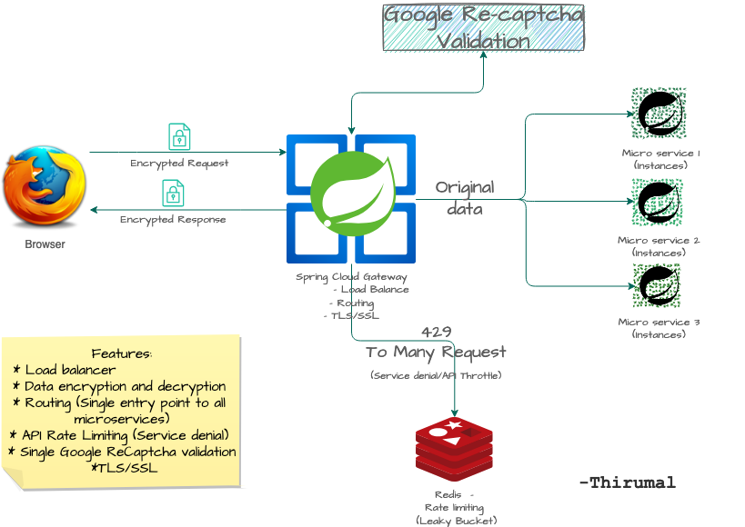
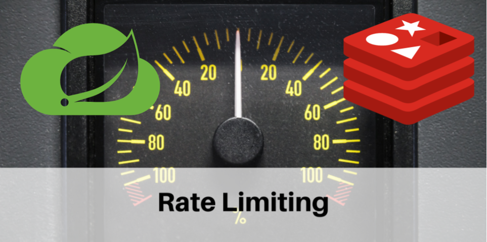
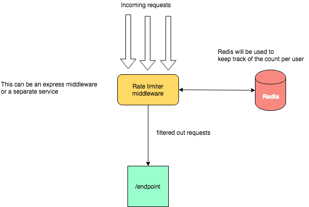

# spring-cloud-gateway




## Features:

* Rate Limiter
* Circuit Breaker
* [Whitelisting IP address](#White-list-IP)
* Encryption and Decryption of request and response body  
* Google Re-Captcha validation at gateway for all microservices
* TLS/SSL


## Prerequisite - To Run the following projects to get the proper result

1. [Eureka Server](https://github.com/M-Thirumal/eureka-server)
2. [Eureka Client 1 / MicroServices 1](https://github.com/M-Thirumal/eureka-client-2)
3. [Eureka Client 2 / MicroServices 2](https://github.com/M-Thirumal/eureka-client-1)
4. [Redis](https://m-thirumal.github.io/installation_guide/#/redis/install)

## To Create jar

 `mvn clean package -DskipTests=true`

## Run as jar from terminal

`java -jar target/spring-cloud-gateway-0.0.1-SNAPSHOT.jar`

## Routing and Load balancer


## Encryption & Decryption

Encryption of request body and response body is implemented in global filter and in route 2.

```
f.filter(encryptDecryptFilter.apply(new EncryptDecryptFilter.Config()))
```

## Rate Limiter 

 i.e Service Denial



Redis is used for rate limiter, which is used for protecting application from API throttling (Service Denial)



## Circuit Breaker

Circuit Breaker has three states `Closed State, Open State, Half Open State`. The image below shows how the flow from one state to another changes.

  1. The Circuit Breaker will be in the `Closed state` when everything is running as expected when failure starts coming it waits until the set `threshold limit` is reached then goes to `Open state`.
  
  2. While in `Open states` no calls will be going to failing remote service until certain wait time, then it goes to `Half-Open state`, in this stage reduced amount of calls goes to remote service to make sure the calls are successful, `IF` the calls are responding as `expected` it will go to `Closed state` or it goes back to `Open state` avoiding calls to failing remote service.


## Google Recaptcha

Google Recaptcha can be verified at gateway instead of verifying it in each microservices. Avoid code duplication


## TLS/SSL

To Enable SSL, add the following properties in the `yml` file and add the certificate in `.p12` format

```
server:
  port: 9095
  ssl: 
    enabled: true
    key-store: classpath:keystore.p12
    key-store-password: thirumal
    key-store-type: PKCS12
    key-alias: gateway
  compression:
    enabled: true
```

Get free SSL certificate from [Let's Encrypt](https://github.com/m-thirumal/installation_guide/blob/master/docs/TLS/let's_encrypt.md)

To Generate the `.p12` from `.pem` use the following commands

```
openssl pkcs12 -export -in fullchain1.pem -inkey privkey1.pem -out keystore.p12 -name gateway -CAfile chain1.pem -caname root
```

## White list IP

!> `127.0.0.1` (localhost) is whitelisted in this. To disable `Whitelist` option, just comment `@component` in the class `/spring-cloud-gateway/src/main/java/in/thirumal/filter/IpWhitelistFilter.java`

